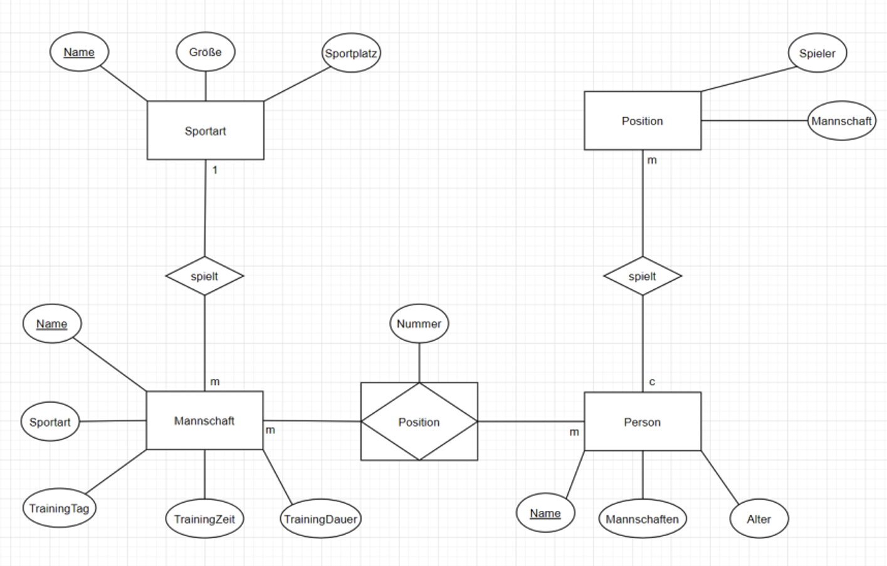

---
hide:
  - navigation
---

# GEK12 Datenmodellierung

## Einführung

Nun gilt es nicht nur Daten aus einer Datenbank abzufragen, sondern auch eine Datenbank zu erstellen. In der Datenmodellierung gilt es sich zu fragen was wie gespeichert werden soll. Dazu soll aus einer Beschreibung das Datenmodell als Diagramm extrahiert werden.

## Ziele

Es wird versucht aus einer nicht technischen Beschreibung die erforderlichen Elemente herauszufiltern und in ein ERD Entity-Relationship-Diagramm zu modellieren.

## Kompetenzzuordnung

#### GK Datenbankmodellierung

* Datenmodellierung (Entitäten, Attribute, Schlüsselkandidaten), konzeptioneller Entwurf, Entity-Relationship-Model  Kardinalitäten/Multiplizitäten, Primäre Schlüsselarten, is- a/Vererbung, schwache/starke Entitäten

## Voraussetzungen

* *GK11 Einfache Abfragen* abgeschlossen

## Fragestellungen

Bitte versuche alle wichtigen Informationen kurz und prägnant als Dokumentation laut den Dokumentationsrichtlinien zu verschriftlichen nachdem du folgende Skripte durchgearbeitet hast: [Datenmodellierung 1 - Konzepte, Begriffe](https://github.com/TGM-HIT/insy-exercises/blob/main/docs/1.Semester/12_Datenmodellierung/Datenmodellierung%201%20-%20Konzepte%2C%20Begriffe.pdf); [Datenmodellierung 2 - ERM, ERD](https://github.com/TGM-HIT/insy-exercises/blob/main/docs/1.Semester/12_Datenmodellierung/Datenmodellierung%202%20-%20ERM%2C%20ERD.pdf)

### Grundlegend

* Was bedeutet Modellierung?
* Was sind Objekte, Entitäten und Schlüsselkandidaten? Nenne Beispiele.
* Welche Arten von Schlüsselkandidaten kennst du? Was sind die Vor- und Nachteile?
* Was sind Kardinalitäten, Optionalitäten, Super/Subtypen?
* Welche Arten von Beziehungen gibt es im ERD?
* Werden UMLs auch für Datenmodelle verwendet? Was sind die Unterschiede, Vor- und Nachteile?
* Wie funktioniert die m:n Ersatzdarstellung?

### Erweitert

* Was sind schwache Entitäten und wo werden sie angewandt?

TIPP: in den Quellen findest du die Antworten zu all diesen Fragen mit nur einem Klick.

## Detaillierte Aufgabenbeschreibung
### Grundanforderungen

Nachdem du die Fragestellungen ausgearbeitet hast, siehe dir folgende Aufgabenstellungen an.

> Ein Landwirtschaftsbetrieb züchtet verschiedene Tiere (Kühe, Schweine, etc.). Jedes Tier hat einen Namen, ein Geburtsdatum, Schulterhöhe und Gewicht. Es ist im Zuchtregister mit einer Nummer gekennzeichnet. Der Landwirt verwaltet zu jedem Tier die bevorzugte Futtersorte, dessen Hersteller und Preis. Von den Futterherstellern sind Name, Anschrift, Name und Telefonnummer des Vertreters bekannt. Die Tiere sind in mehreren Ställen untergebracht. Sie stehen dort in Boxen (nach Art getrennt). Für die Stalljungen ist noch die Information notwendig, welchen Belag (Heu, Sand, etc.) sie in jede Box streuen sollen.

Schreibe dir zuerst alle Objekttypen, Attribute und Schlüsselkandidaten heraus. Erstelle dann ein entsprechendes ERD. Dieses kann Handschriftlich oder mit einem Tool gezeichnet sein (zb. [diagrams.net](https://app.diagrams.net/)).

Das ERD sollte den Regeln und Standarts aus den Skripten entsprechen und alle Entitäten, Attribute, Beziehungen, Kardinalitäten und Optionalitäten enthalten. Vergleiche mit dem Beispiel ERD.

??? Beispiel-ERD

    

### Erweitert

Wähle anhand deiner Katalognummer (katnr. % 5) von den folgenden Aufgabenstellungen deine und erstelle ein vollständiges ERD.

0: Autovermietung  
1: Fluggesellschaft  
2: Schnellbahn-Unternehmen  
3: Tankstellenkette  
4: Videoverleih

## Abgabe
Die durchgeführten Tätigkeiten und gewünschten Elemente müssen in einer Dokumentation gemäß der Dokumentationsrichtlinien zusammengefasst werden. Die Fragestellungen sollen mit Quellen ebenfalls in diesem Dokument bearbeitet werden.

Bei einem Abgabegespräch sind die laufende Umgebung sowie kurze Kontrollfragen zwecks Verständnisüberprüfung notwendig. Vor diesem Gespräch ist die Dokumentation eingescannt als ein **PDF** File auf moodle abzugeben. (Microsoft Office Lens [Android](https://play.google.com/store/apps/details?id=com.microsoft.office.officelens&hl=de_AT&gl=US), [iPhone](https://apps.apple.com/at/app/microsoft-office-lens-pdf-scan/id975925059); Online PDF Editor [pdffiller](https://www.pdffiller.com/de/))

## Bewertung
Gruppengröße: 1 Person
### Grundanforderungen **überwiegend erfüllt**
- [ ] Erfüllen des Moodle Test
- [ ] Abgabe der Dokumentation über Fragenstellung und Aufgaben
### Grundanforderungen **zur Gänze erfüllt**
- [ ] Abgabegespräch über Fragestellungen und Aufgaben
### Erweiterte Anforderungen **überwiegend erfüllt**

- [ ] Erfüllen der erweiternden Aufgabenstellung 

### Erweiterte Anforderungen **zur Gänze erfüllt**

- [ ] Erweiterte Fragestellungen beantwortet

## Quellen
* "Microsoft Office Lens";  [Android](https://play.google.com/store/apps/details?id=com.microsoft.office.officelens&hl=de_AT&gl=US), [iPhone](https://apps.apple.com/at/app/microsoft-office-lens-pdf-scan/id975925059)
* "Online PDF Editor"; zuletzt besucht 2021-08-06; [pdffiller](https://www.pdffiller.com/de/)
* "flightdatabase"; tgm Projekteserver; [flightdatabase](https://projekte.tgm.ac.at/phpmyadmin/index.php) (user: *flightdata* pw: *IbelieveIcanfly*)
* "Flightdata Schema"; GitHub, zuletzt besucht 2024-08-11; [online](https://github.com/TGM-HIT/insy-exercises/blob/main/docs/1.Semester/11_Einfache_Abfragen/FlightDataStructure.pdf)
* "SQL Tutorial"; w3cschools; zuletzt besucht 2022-08-01; [w3cschools.com](https://www.w3schools.com/sql/)
* "Datenmodellierung 1 - Konzepte, Begriffe" Github; Erhard List; zuletzt besucht 2024-08-11 [online](https://github.com/TGM-HIT/insy-exercises/blob/main/docs/1.Semester/12_Datenmodellierung/Datenmodellierung%201%20-%20Konzepte%2C%20Begriffe.pdf)
* "Datenmodellierung 2 - ERM, ERD" Github; Erhard List; zuletzt besucht 2024-08-11 [online](https://github.com/TGM-HIT/insy-exercises/blob/main/docs/1.Semester/12_Datenmodellierung/Datenmodellierung%202%20-%20ERM%2C%20ERD.pdf)

---
**Version** *20240811v3*