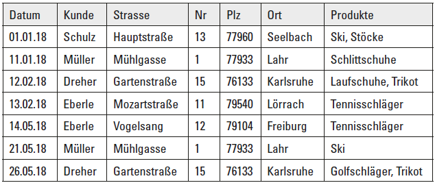
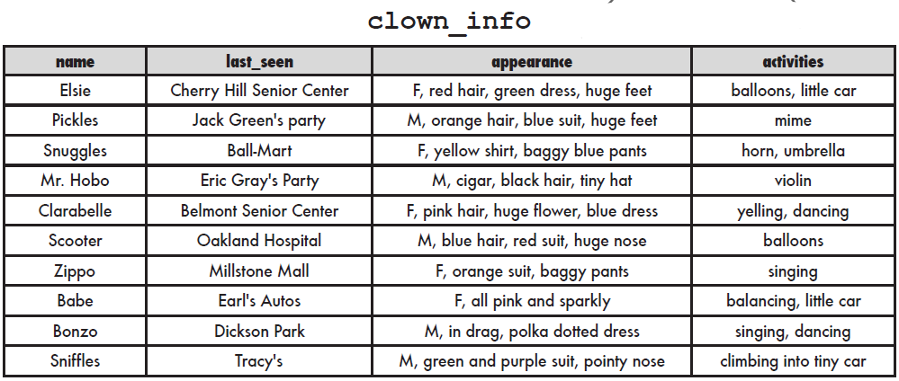

---
hide:
  - navigation
---

# GK16 Normalformen

## Einführung

Nun ist dir bestimmt schon aufgefallen, dass es unendlich viele Möglichkeiten gibt, ein Datenmodell für eine gegebene Aufgabenstellung zu erstellen. Doch welches ist das beste Modell?

## Ziele

Ein Datenmodell über 1. und 2. in die 3. Normalform bringen.

## Kompetenzzuordnung

#### GK Datenbanksysteme

* 1., 2., und 3. Normalform

## Voraussetzungen

* *GK15 semistrukturierte Datentypen* abgeschlossen

## Fragestellungen

Bitte versuche alle wichtigen Informationen kurz und prägnant als Dokumentation laut den Dokumentationsrichtlinien zu verschriftlichen.

### Grundlegend

* Was bedeutet atomar?
* Wann ist ein Datenbank-Schame in der 1. Normalform?
* Was sind Redundanzen?
* Was sind funktionale Abhängigkeiten?
* Wann ist ein Datenbank-Schame in der 2. Normalform?
* Was sind transitive Abhängigkeiten?
* Welchen Sinn machen Normalformen?

TIPP: in den Quellen findest du die Antworten zu all diesen Fragen mit nur einem Klick.

## Detaillierte Aufgabenbeschreibung

Bearbeite folgende Aufgabenstellungen nachdem du die Fragestellungen beantwortet hast.

### Grundanforderungen

#### 1. Fitnessstudio

##### Ausgangssituation

Ein Fitnessstudio verwaltet die Anmeldungen seiner Mitglieder zu Kursen in einer einzigen, unstrukturierten Tabelle:

| AnmeldungID | MitgliedName | MitgliedEmail   | Kurse                                                        |
| ----------- | ------------ | --------------- | ------------------------------------------------------------ |
| 1           | Fischer      | fischer@mail.at | Yoga (Mo 18:00, Trainer: Bauer), Spinning (Di 19:00, Trainer: Novak) |
| 2           | Gruber       | gruber@mail.at  | Pilates (Mi 17:00, Trainer: Bauer)                           |
| 3           | Wolf         | wolf@mail.at    | Yoga (Mo 18:00, Trainer: Bauer)                              |

**Zusätzliche Information:** Jeder Kurs findet immer zur selben Zeit mit demselben Trainer statt (z. B. ist "Yoga" immer Montag 18:00 mit Trainer Bauer, unabhängig davon, wer sich anmeldet).

---

##### 1. Normalform

**a)** Erkläre in eigenen Worten, warum die obige Tabelle NICHT der 1. Normalform entspricht.

**b)** Forme die Tabelle so um, dass sie der 1. Normalform entspricht. Trage deine Lösung in eine Tabelle ein (füge bei Bedarf weitere Zeilen und Spalten hinzu).

| AnmeldungID | MitgliedName | MitgliedEmail | ...  |
| ----------- | ------------ | ------------- | ---- |
|             |              |               |      |
|             |              |               |      |
|             |              |               |      |
|             |              |               |      |

**c)** Wie lautet jetzt der (zusammengesetzte) Primärschlüssel dieser Tabelle?

---

##### 2. Normalform

**a)** Welche funktionalen Abhängigkeiten bestehen in deiner Tabelle aus Aufgabe 1? Prüfe für jedes Nicht-Schlüsselattribut: Hängt es vom gesamten Primärschlüssel ab, oder nur von einem Teil davon? Schreibe alle Abhängigkeiten auf!

**b)** Teile die Tabelle so auf, dass sie der 2. Normalform entspricht. Notiere die entstehenden Tabellen und markiere jeweils den Primärschlüssel.

---

##### 3. Normalform

**a)** Erweitere jetzt die Trainer-Information um ein Attribut `TrainerTelefonnummer`. Angenommen, jeder Trainer hat genau eine Telefonnummer. Welches Problem entsteht dadurch bezüglich der 3. Normalform, wenn du `TrainerTelefonnummer` einfach in die Kurstabelle einfügst?

**b)** Löse das Problem und notiere die finalen Tabellen in 3. Normalform (mit allen Attributen und Primär-/Fremdschlüsseln). Schreibe alle Abhängigkeiten auf!

#### 2. Bestellungen

Bringe folgende Bestellungen-Tabelle in die 3. Normalform. Halte dich an die Regeln aus den Unterlagen und dem Prozess von oben.
Dokumentiere auch die Abhängigkeiten.

#### 3. Clowns

Bringe folgende Bestellungen-Tabelle in die 3. Normalform. Halte dich an die Regeln aus den Unterlagen und dem Prozess von oben.
Dokumentiere auch die Abhängigkeiten.

[Weitere Übungen](https://github.com/TGM-HIT/insy-exercises/tree/main/docs/1.Semester/16_Normalformen/exercises)

## Abgabe
Die durchgeführten Tätigkeiten und gewünschten Elemente müssen in einer Dokumentation gemäß der Dokumentationsrichtlinien zusammengefasst werden. Die Fragestellungen sollen mit Quellen ebenfalls in diesem Dokument bearbeitet werden.

Bei einem Abgabegespräch sind die laufende Umgebung sowie kurze Kontrollfragen zwecks Verständnisüberprüfung notwendig. Vor diesem Gespräch ist die Dokumentation eingescannt als ein **PDF** File auf moodle abzugeben. (Microsoft Office Lens [Android](https://play.google.com/store/apps/details?id=com.microsoft.office.officelens&hl=de_AT&gl=US), [iPhone](https://apps.apple.com/at/app/microsoft-office-lens-pdf-scan/id975925059); Online PDF Editor [pdffiller](https://www.pdffiller.com/de/))

## Bewertung
Gruppengröße: 1 Person

### Grundanforderungen **überwiegend erfüllt**

-  Erfüllen des Moodle Test
-  Abgabe der Dokumentation über Fragenstellung und Aufgaben
-  Check durch die Lehrperson

### Grundanforderungen **zur Gänze erfüllt**

-  Abgabegespräch über Fragestellungen und Aufgaben

## Quellen
* "Microsoft Office Lens";  [Android](https://play.google.com/store/apps/details?id=com.microsoft.office.officelens&hl=de_AT&gl=US), [iPhone](https://apps.apple.com/at/app/microsoft-office-lens-pdf-scan/id975925059)
* "Online PDF Editor"; zuletzt besucht 2021-08-06; [pdffiller](https://www.pdffiller.com/de/)
* "flightdatabase"; tgm Projekteserver; [flightdatabase](https://projekte.tgm.ac.at/phpmyadmin/index.php) (user: *flightdata* pw: *IbelieveIcanfly*)
* "SQL Tutorial"; w3cschools; zuletzt besucht 2022-08-01; [w3cschools.com](https://www.w3schools.com/sql/)
* "Datenmodellierung 4 - Normalisierung" ; GitHub; Erhard List; zuletzt besucht 2024-08-12; [online](https://github.com/TGM-HIT/insy-exercises/blob/main/docs/1.Semester/16_Normalformen/Datenmodellierung%204%20-%20Normalisierung.pdf)

---
**Version** *20260812v4*